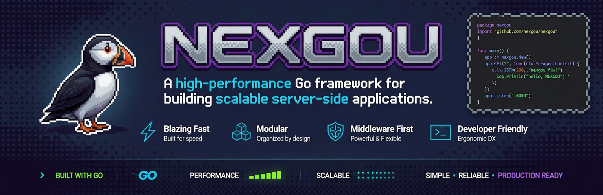

<div align="center">

<br/>



# Nexgou

**Un framework Go progresivo para construir APIs HTTP rápidas, modulares y listas para producción.**

Claridad arquitectónica inspirada en NestJS, con rendimiento Go y despliegue simple.

<br/>

[](https://golang.org)
[](LICENSE)
[]()
[](https://github.com/nexgou/server/actions)

[English](README.md) · [Español](README.es.md)

</div>

---

## Qué Es

Nexgou es un framework de aplicación para servicios HTTP en Go. Incluye módulos, inyección de dependencias, controladores, middleware, guards, interceptores, pipes, filtros, configuración, logger, helpers de testing y ejemplos preparados para benchmark.

Es para equipos que necesitan más que un router, sin perder la simplicidad ni el rendimiento de Go.

## Para Qué Sirve

- Crear APIs REST con límites claros por dominio.
- Mantener la lógica de negocio inyectable y testeable.
- Aplicar auth, validación, logging, seguridad y errores de forma consistente.
- Publicar servicios fáciles de medir, observar y evolucionar.

## Ventajas

| Necesidad                 | Nexgou    | Stack típico basado en routers |
| ------------------------- | --------- | ------------------------------ |
| Módulos por dominio       | Incluido  | Convenciones manuales          |
| Inyección de dependencias | Incluida  | Normalmente custom             |
| Guards e interceptores    | Incluidos | Workarounds con middleware     |
| Pipes y validación        | Incluidos | Código dentro del handler      |
| Filtros de excepción      | Incluidos | Mapeo manual de errores        |
| Config y logger           | Incluidos | Paquetes extra/globals         |
| Helpers de testing        | Incluidos | Setup propio del proyecto      |

Nexgou no intenta reemplazar routers pequeños para handlers mínimos. Está pensado para aplicaciones donde importan la estructura, los tests y los flujos repetibles.

## Benchmark

Los datos actuales están en [benchmark](benchmark) y [benchmark/RESULT_HTTP_PERFORMANCE.md](benchmark/RESULT_HTTP_PERFORMANCE.md).

| Rank | Servicio      | Stack                    | Req/s prom. | p95 prom. | Errores |
| ---: | ------------- | ------------------------ | ----------: | --------: | ------: |
|    1 | `actix-web`   | Rust + Actix Web         |   21,788.89 |  15.37 ms |      0% |
|    2 | `hyper`       | Rust + Hyper             |   21,453.22 |  15.10 ms |      0% |
|    3 | `nexgou`      | Go + NexGou              |   20,102.40 |  16.84 ms |      0% |
|    4 | `vert-x`      | Java + Vert.x Web        |   17,285.19 |  19.40 ms |      0% |
|    5 | `asp-kestrel` | ASP.NET Core Minimal API |   16,124.23 |  26.59 ms |      0% |
|    6 | `fastify`     | Node.js + Fastify        |    9,182.02 |  32.95 ms |      0% |
|    7 | `ajax-php`    | PHP + PDO SQLite         |    2,384.51 |  84.85 ms |      0% |

Entorno: Docker Compose en Windows, k6, 200 VUs, 30s por escenario, 4 CPU y 2 GB RAM por servicio.

## Instalación

```bash
go get github.com/nexgou/server
```

Requiere Go 1.25 o superior.

## Módulos del Ecosistema

Los módulos públicos están disponibles en la [organización nexgou en GitHub](https://github.com/orgs/nexgou/repositories). Los imports siguen el formato `github.com/nexgou/<modulo>`.

| Módulo | Para qué sirve | Import |
| --- | --- | --- |
| [server](https://github.com/nexgou/server) | Framework principal | `github.com/nexgou/server` |
| [caching](https://github.com/nexgou/caching) | Abstracción de caché | `github.com/nexgou/caching` |
| [compression](https://github.com/nexgou/compression) | Compresión HTTP | `github.com/nexgou/compression` |
| [cookie](https://github.com/nexgou/cookie) | Helpers de cookies | `github.com/nexgou/cookie` |
| [cron](https://github.com/nexgou/cron) | Tareas programadas | `github.com/nexgou/cron` |
| [database](https://github.com/nexgou/database) | Módulo base de base de datos | `github.com/nexgou/database` |
| [events](https://github.com/nexgou/events) | Emisión de eventos | `github.com/nexgou/events` |
| [fileupload](https://github.com/nexgou/fileupload) | Subida de archivos | `github.com/nexgou/fileupload` |
| [graphql](https://github.com/nexgou/graphql) | Integración GraphQL | `github.com/nexgou/graphql` |
| [grpc](https://github.com/nexgou/grpc) | Transporte gRPC | `github.com/nexgou/grpc` |
| [jwt](https://github.com/nexgou/jwt) | Autenticación JWT | `github.com/nexgou/jwt` |
| [mongo](https://github.com/nexgou/mongo) | Integración MongoDB | `github.com/nexgou/mongo` |
| [mqtt](https://github.com/nexgou/mqtt) | Integración MQTT | `github.com/nexgou/mqtt` |
| [nats](https://github.com/nexgou/nats) | Integración NATS | `github.com/nexgou/nats` |
| [postgres](https://github.com/nexgou/postgres) | Integración PostgreSQL | `github.com/nexgou/postgres` |
| [queues](https://github.com/nexgou/queues) | Abstracción de colas | `github.com/nexgou/queues` |
| [rabbitmq](https://github.com/nexgou/rabbitmq) | Integración RabbitMQ | `github.com/nexgou/rabbitmq` |
| [redis](https://github.com/nexgou/redis) | Integración Redis | `github.com/nexgou/redis` |
| [scheduler](https://github.com/nexgou/scheduler) | Planificación de tareas | `github.com/nexgou/scheduler` |
| [serialization](https://github.com/nexgou/serialization) | Helpers de serialización | `github.com/nexgou/serialization` |
| [sqlite](https://github.com/nexgou/sqlite) | Integración SQLite | `github.com/nexgou/sqlite` |
| [sqs](https://github.com/nexgou/sqs) | Integración AWS SQS | `github.com/nexgou/sqs` |
| [streaming](https://github.com/nexgou/streaming) | Helpers de streaming | `github.com/nexgou/streaming` |
| [validation](https://github.com/nexgou/validation) | Módulo de validación | `github.com/nexgou/validation` |
| [websocket](https://github.com/nexgou/websocket) | Transporte WebSocket | `github.com/nexgou/websocket` |

## Uso Rápido

```go
package main

import (
    "log"
    "time"

    nexgou "github.com/nexgou/server"
    "github.com/nexgou/server/src/filter"
    "github.com/nexgou/server/src/middleware"
)

var AppModule = nexgou.Module(nexgou.ModuleOptions{
    Controllers: []any{NewUserController},
})

type UserController struct{}

func NewUserController() *UserController { return &UserController{} }

func (c *UserController) Register() []nexgou.Route {
    return []nexgou.Route{
        nexgou.Get("/users", c.FindAll).Version("v1"),
    }
}

func (c *UserController) FindAll(ctx *nexgou.Context) error {
    return ctx.JSON(200, nexgou.H{"users": []string{"alice", "bob"}})
}

func main() {
    app := nexgou.CreateApp(AppModule)
    app.Use(middleware.Recovery())
    app.Use(middleware.SecurityHeaders())
    app.Use(middleware.RateLimit(100, time.Minute))
    app.SetFilter(&filter.HttpExceptionFilter{})

    log.Fatal(app.Listen(3000))
}
```

Puedes ver ejemplos completos en [samples/api](samples/api) y [samples/taskboard](samples/taskboard).

## Documentación

- [Primeros pasos](docs/es/getting-started.md)
- [Módulos](docs/es/modules.md)
- [Controladores](docs/es/controllers.md)
- [Middleware](docs/es/middleware.md)
- [Seguridad](docs/es/security.md)
- [Config](docs/es/config.md)
- [Logger](docs/es/logger.md)
- [Testing](docs/es/testing.md)
- [Benchmark](docs/BENCHMARK.md)

## Contribución

Las contribuciones son bienvenidas. Lee [CONTRIBUTING.md](CONTRIBUTING.md) antes de abrir un pull request.

Para reportes de seguridad, usa [SECURITY.md](SECURITY.md).

## Licencia

Nexgou se publica bajo la [Licencia MIT](LICENSE).
